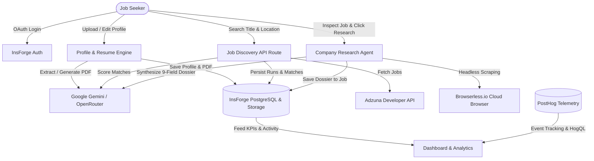

# JobPilot 🚀

[](https://nextjs.org/)
[](https://react.dev/)
[](https://www.typescriptlang.org/)
[](https://tailwindcss.com/)
[](https://insforge.dev)
[](https://posthog.com/)

> **Autonomous AI-powered job hunting assistant that searches, scores, researches, and prepares tailored dossiers for job seekers in minutes.**

---

## 📖 Table of Contents

- [Overview](#-overview)
- [The Problem JobPilot Solves](#-the-problem-jobpilot-solves)
- [Key Features](#-key-features)
- [System Architecture & Data Flow](#-system-architecture--data-flow)
- [Tech Stack](#-tech-stack)
- [Directory Structure](#-directory-structure)
- [Database Schema](#-database-schema)
- [Prerequisites & Environment Variables](#-prerequisites--environment-variables)
- [Getting Started](#-getting-started)
- [Core Workflows](#-core-workflows)
- [Available Scripts](#-available-scripts)
- [Troubleshooting & FAQ](#-troubleshooting--faq)
- [Attribution & Credits](#-attribution--credits)

---

## 🎯 Overview

**JobPilot** is a production-ready, full-stack AI career companion. Instead of manually sifting through hundreds of irrelevant job postings, guessing compatibility, or spending hours researching company cultures before applying, JobPilot handles the entire research and preparation lifecycle autonomously:

1. **One-Time Profile Setup & Resume Parsing:** Upload an existing resume to auto-populate your skills, experience, and preferences using Gemini multimodal extraction, or generate an ATS-compliant PDF directly from your profile.
2. **Universal Job Discovery via Adzuna:** Search live jobs across titles and locations with automatic schema normalization and deduplication.
3. **AI Match Scoring:** Google Gemini analyzes each job against your structured profile, computing a 0–100 match score with granular matched skills, missing skills, and detailed reasoning.
4. **Autonomous Company Research Agent:** Headless browser automation via Browserless navigates the company's real web footprint (homepage, engineering blogs, careers pages). Gemini synthesizes findings into an actionable 9-point dossier covering tech stack, engineering culture, strategic role context, candidate edge, and custom interview talking points.
5. **Real-Time KPI & Analytics Dashboard:** PostHog-powered analytics paired with direct database telemetry track search volume, score distributions, and company research activity over time.

---

## 💡 The Problem JobPilot Solves

Job hunting is notoriously draining and repetitive:
- **Keyword Guesswork:** Applicants apply blindly without knowing if their profile meets ATS or recruiter criteria.
- **Surface-Level Company Info:** Researching engineering cultures, tech stacks, and team priorities requires manually hunting across dozens of external websites.
- **Unstructured Tracking:** Job seekers lose track of discovered postings, matching rationale, and interview talking points.

JobPilot turns job discovery into a high-leverage command center. All discovered positions are scored, structured, and enriched with deep company intelligence so you apply with complete confidence.

---

## ✨ Key Features

| Feature | Description |
| :--- | :--- |
| **🔐 InsForge Auth** | Seamless GitHub and Google OAuth authentication with secure cookie session handling. |
| **📄 AI Resume Extraction & ATS Builder** | Upload existing PDF resumes for zero-touch profile auto-fill via Gemini. Generate clean, ATS-optimized PDFs with `@react-pdf/renderer` saved to secure cloud storage. |
| **🌐 Adzuna Real-Time Discovery** | High-speed job ingestion across roles and locations with structured pagination, salary extraction, and direct external application links. |
| **🎯 Intelligent Match Engine** | Batch-scored by Gemini 3.1 Flash Lite (`0-100%`) with visual score pills, green matched-skill tags, and red missing-skill flags. |
| **🕵️ Deep Company Research Agent** | Headless browser scrapes company web presences in real-time. Synthesizes a 9-field dossier: overview, tech stack, culture, why the role exists, candidate edge, gaps to address, smart interview questions, and prep talking points. |
| **📊 PostHog & BaaS Analytics** | Dual-source analytics combining PostHog event telemetry (`job_search_started`, `job_found`, `company_researched`) with InsForge database queries. Interactive trend area curves, score distribution histograms, and activity timelines. |
| **🎨 Responsive Modern Design System** | Clean, mobile-friendly interface built with Tailwind CSS, custom design tokens, Lucide icons, and zero arbitrary color hexes. |

---

## 🏗️ System Architecture & Data Flow



### Architecture Invariants

- **Separation of Concerns:** API routes handle transport and authentication; pure business logic lives in `/agent` and `/lib`.
- **Stateless Agent Execution:** Agent tasks run server-side, logging step-by-step progress to `agent_logs` and storing results in `jobs` and `agent_runs`.
- **Fault-Tolerant Research:** If a company blocks web scraping or has no reachable website, the agent gracefully degrades to synthesizing insights from the job description and company name—never failing the user experience.
- **Strict Row-Level Security (RLS):** All database operations and resume file uploads are scoped strictly to the authenticated `user_id`.

---

## 💻 Tech Stack

| Layer | Technology | Details |
| :--- | :--- | :--- |
| **Framework** | [Next.js 16 (App Router)](https://nextjs.org/) | Full-stack server and client architecture with React 19 |
| **Language** | [TypeScript 5](https://www.typescriptlang.org/) | Strict type checking across API, DB, and UI layers |
| **Backend & Database** | [InsForge](https://insforge.dev) | PostgreSQL database, Auth (OAuth), and Object Storage |
| **AI Ingestion & Reasoning** | [Google Gemini](https://openrouter.ai/) | `google/gemini-3.1-flash-lite` via OpenRouter SDK |
| **Cloud Scraping** | [Browserless.io](https://www.browserless.io/) | Headless Chrome REST content extraction |
| **Job Feed API** | [Adzuna API](https://developer.adzuna.com/) | Real-time global technology and professional job feed |
| **Analytics & Telemetry** | [PostHog](https://posthog.com/) | `posthog-js` (client), `posthog-node` (server), and HogQL query API |
| **PDF Generation** | [@react-pdf/renderer](https://react-pdf.org/) | Single-page ATS resume rendering directly to server buffer |
| **UI Components & Icons** | [Tailwind CSS 4](https://tailwindcss.com/) & [Lucide React](https://lucide.dev/) | Consistent design token architecture |

---

## 📁 Directory Structure

```
jobpilot/
├── actions/                         # Server actions for mutations
│   └── profile.ts                   # Profile upsert, resume upload & completion calculation
├── agent/                           # Isolated agent logic (no React / UI code)
│   ├── adzuna.ts                    # Adzuna job search & Gemini scoring pipeline
│   ├── extractor.ts                 # Resume text extraction logic
│   ├── matcher.ts                   # Deep candidate-job matching algorithms
│   ├── research.ts                  # Browserless scraping & company dossier synthesis
│   └── types.ts                     # TypeScript definitions for agent runs & dossiers
├── app/                             # Next.js App Router pages & API handlers
│   ├── (auth)/                      # Auth flows (login, OAuth callback)
│   ├── api/
│   │   ├── agent/find/route.ts      # Adzuna job discovery trigger endpoint
│   │   ├── agent/research/route.ts  # Company research agent trigger endpoint
│   │   ├── resume/extract/route.ts  # AI resume PDF text parsing endpoint
│   │   └── resume/generate/route.ts # ATS resume PDF generation endpoint
│   ├── dashboard/page.tsx           # Dashboard KPIs, recent activity, analytics charts
│   ├── find-jobs/
│   │   ├── page.tsx                 # Search controls, filters, and paginated job cards
│   │   └── [id]/page.tsx            # Job details view & interactive research dossier
│   ├── profile/page.tsx             # Interactive profile form & resume previewer
│   ├── layout.tsx                   # Root layout, fonts, and PostHog provider
│   └── page.tsx                     # Landing page with hero, features, and how-it-works
├── components/                      # Modular React presentation components
│   ├── dashboard/                   # StatsBar, RecentActivity, and chart components
│   ├── find-jobs/                   # SearchControls, JobFilters, JobsTable, Pagination
│   ├── homepage/                    # Hero, HowItWorks, and Features sections
│   ├── job-details/                 # JobHeader, SkillsComparison, CompanyResearch dossier
│   ├── layout/                      # Navbar with branding and Footer
│   └── profile/                     # ProfileForm, ResumeUpload, and CompletionIndicator
├── context/                         # Architecture specs, design tokens, and build guides
├── lib/                             # Shared client instances & utility helpers
│   ├── adzuna.ts                    # Adzuna API client
│   ├── browserless.ts               # Headless browser scrapers & sub-link extractors
│   ├── insforge.ts                  # InsForge browser & server client factory
│   ├── posthog-analytics.ts         # Dual-source PostHog HogQL + BaaS analytics service
│   ├── posthog-client.ts            # Client-side PostHog tracker
│   ├── posthog-server.ts            # Server-side PostHog telemetry
│   └── utils.ts                     # Score thresholds, date formatters, and style utilities
├── middleware.ts                    # Session authentication route guard
└── types/index.ts                   # Global domain TypeScript definitions
```

---

## 🗄️ Database Schema

The database is built on PostgreSQL hosted via **InsForge**. All tables use UUID primary keys and enforce Row-Level Security (RLS) linked to `auth.users(id)`.

### 1. `profiles`
Stores candidate resumes, career history, education, skills, and preferences.
- `id`: `UUID` (PK, references `auth.users`)
- `full_name`, `email`, `phone`, `location`: `TEXT`
- `current_title`, `experience_level`, `years_experience`: Role details
- `skills`, `industries`, `job_titles_seeking`: `TEXT[]`
- `work_experience`, `education`: `JSONB`
- `resume_pdf_url`, `resume_pdf_key`: `TEXT` (InsForge Storage pointers)
- `is_complete`, `completion_percentage`: Profile health score (`0-100%`)

### 2. `agent_runs`
Maintains execution history and metrics for Adzuna job search executions.
- `id`: `UUID` (PK)
- `user_id`: `UUID` (references `profiles.id`)
- `status`: `'running' | 'completed' | 'failed'`
- `job_title_searched`, `location_searched`: `TEXT`
- `jobs_found`: `INTEGER`
- `started_at`, `completed_at`: `TIMESTAMPTZ`

### 3. `jobs`
Stores normalized job listings and their associated AI match and research intelligence.
- `id`: `UUID` (PK)
- `run_id`: `UUID` (references `agent_runs.id`)
- `user_id`: `UUID` (references `profiles.id`)
- `title`, `company`, `location`, `salary`, `job_type`: Normalized job metadata
- `source_url`, `external_apply_url`: External listing links
- `about_role`, `about_company`: Synthesized summaries
- `responsibilities`, `requirements`, `nice_to_have`, `benefits`: `TEXT[]`
- `match_score`: `INTEGER` (`0-100`)
- `match_reason`: `TEXT`
- `matched_skills`, `missing_skills`: `TEXT[]`
- `company_research`: `JSONB` (9-field research dossier)
- `found_at`: `TIMESTAMPTZ`

### 4. `agent_logs`
Chronological operational logs for debugging and auditing agent executions.
- `id`: `UUID` (PK)
- `run_id`: `UUID` (references `agent_runs.id`)
- `user_id`: `UUID` (references `profiles.id`)
- `message`: `TEXT`
- `level`: `'info' | 'success' | 'warning' | 'error'`
- `created_at`: `TIMESTAMPTZ`

---

## 🔑 Prerequisites & Environment Variables

### Prerequisites

- **Node.js**: `v20.x` or higher
- **npm** (or **pnpm** / **yarn**)
- Active accounts with:
  - [InsForge](https://insforge.dev) (Backend, Auth, Database, Storage)
  - [OpenRouter](https://openrouter.ai/) (Gemini AI API)
  - [Adzuna Developer Portal](https://developer.adzuna.com/) (Job Search API)
  - [Browserless.io](https://www.browserless.io/) (Headless Browser Scraping)
  - [PostHog](https://posthog.com/) (Product Analytics)

### Environment Variables Setup

Copy `.env.example` to `.env.local`:

```bash
cp .env.example .env.local
```

Configure the following variables in `.env.local`:

| Variable | Required | Description | Where to Get |
| :--- | :---: | :--- | :--- |
| `NEXT_PUBLIC_INSFORGE_URL` | **Yes** | InsForge project URL | InsForge Dashboard -> Project Settings |
| `NEXT_PUBLIC_INSFORGE_ANON_KEY` | **Yes** | InsForge public anonymous key | InsForge Dashboard -> API Keys |
| `OPENROUTER_API_KEY` | **Yes** | OpenRouter API key for Gemini models | [openrouter.ai/keys](https://openrouter.ai/keys) |
| `ADZUNA_APP_ID` | **Yes** | Adzuna Developer Application ID | [developer.adzuna.com](https://developer.adzuna.com/) |
| `ADZUNA_APP_KEY` | **Yes** | Adzuna Developer Application Key | [developer.adzuna.com](https://developer.adzuna.com/) |
| `BROWSERLESS_API_KEY` | **Yes** | Browserless Headless Chrome API Key | [browserless.io](https://www.browserless.io/) |
| `NEXT_PUBLIC_POSTHOG_KEY` | **Yes** | PostHog Client Project API Key | PostHog Project Settings -> API Keys |
| `NEXT_PUBLIC_POSTHOG_HOST` | **Yes** | PostHog ingest URL (e.g. `https://us.i.posthog.com`) | PostHog Ingest Setup |
| `POSTHOG_PERSONAL_API_KEY` | _Optional_ | Personal API key for HogQL Analytics queries | PostHog Settings -> User -> Personal API Keys |
| `POSTHOG_PROJECT_ID` | _Optional_ | PostHog Project ID (required if using HogQL) | PostHog Project Settings |
| `NEXT_PUBLIC_SITE_URL` | _Optional_ | Base deployment URL (defaults to `http://localhost:3000`) | Deployment host |

---

## 🚀 Getting Started

Follow these steps to get JobPilot running locally on your machine:

### 1. Clone the Repository

```bash
git clone https://github.com/Ryan-Shaik/JobPilot.git
cd JobPilot
```

### 2. Install Dependencies

```bash
npm install
```

### 3. Configure Environment Variables

```bash
cp .env.example .env.local
# Open .env.local in your editor and add your API keys
```

### 4. Database & Storage Initialization

In your InsForge project:
1. Ensure the database tables (`profiles`, `agent_runs`, `jobs`, `agent_logs`) and RLS policies are applied.
2. Create a private storage bucket named `resumes` with authenticated user read/write access.

### 5. Launch the Development Server

```bash
npm run dev
```

Open [http://localhost:3000](http://localhost:3000) in your browser.

---

## 🔄 Core Workflows

### 1. Profile Setup & Resume Ingestion
- Navigate to `/profile`.
- Upload a resume PDF and click **Extract from Resume**. Gemini automatically parses work experience, skills, education, and contact information into the form.
- Or, fill the form manually and click **Generate Resume PDF** to let Gemini reformat and compile a single-page ATS-optimized resume saved to your InsForge storage.

### 2. Job Discovery & AI Scoring
- Head to `/find-jobs`.
- Enter a title (e.g., *"Full Stack Engineer"*) and location (e.g., *"San Francisco, CA"*).
- Click **Find Jobs**. The server calls Adzuna API, strips tracking bloat, runs Gemini batch scoring against your profile, and saves the matches to your dashboard.
- Filter by Match Score (High Match $\ge 70\%$, Low Match $< 70\%$) or sort by match rate and posting date.

### 3. Company Research Dossier
- Open any job details page (`/find-jobs/[id]`).
- Click **Research Company**.
- The 5-step animated research sequence triggers:
  1. *Finding company domain*
  2. *Launching headless browser session*
  3. *Extracting tech stack & culture signals*
  4. *Synthesizing tailored dossier with Gemini*
  5. *Saving dossier*
- Review the generated dossier: Tech Stack, Culture, Why This Role Exists, Your Edge, Gaps to Address, Smart Questions to Ask, and Interview Prep talking points.

### 4. One-Click Apply & Tracking
- Click **Apply Now** to open the verified employer posting in a new tab.
- All actions, searches, and research operations feed into the `/dashboard` KPI cards and analytics charts.

---

## 🛠️ Available Scripts

| Command | Action |
| :--- | :--- |
| `npm run dev` | Starts the Next.js local development server on port `3000`. |
| `npm run build` | Compiles the production build of the Next.js application. |
| `npm run start` | Boots the compiled Next.js production server. |
| `npm run lint` | Runs ESLint to verify code style and detect lint errors. |
| `npx tsc --noEmit` | Runs the TypeScript compiler to validate all project types. |

---

## ❓ Troubleshooting & FAQ

### 1. "Browserless error: 401 Unauthorized"
- Verify that `BROWSERLESS_API_KEY` is defined in `.env.local` without trailing spaces.
- Note that if Browserless reaches rate limits or is unreachable, the agent automatically falls back to synthesizing the dossier from the job description and company name.

### 2. "Adzuna API returns 400 or empty results"
- Check that `ADZUNA_APP_ID` and `ADZUNA_APP_KEY` are valid.
- The Adzuna developer API defaults to specific country codes (configured to US `/us/search/1`). For other regions, specify supported locations or adjust the country code in `lib/adzuna.ts`.

### 3. "Analytics charts show fallback data"
- If `POSTHOG_PERSONAL_API_KEY` or `POSTHOG_PROJECT_ID` is omitted, the dashboard automatically falls back to direct database queries from your InsForge `jobs` table so your charts are always populated with real data.

### 4. "PDF Generation buffer error"
- `@react-pdf/renderer` renders server-side in Node.js runtime (`renderToBuffer`). Ensure you are running Node.js 20+.

---

## 📜 Attribution & Credits

- Job data provided by **[Adzuna](https://www.adzuna.com)** API.
- Backend infrastructure powered by **[InsForge](https://insforge.dev)**.
- Telemetry and product analytics powered by **[PostHog](https://posthog.com)**.
- Headless browser infrastructure provided by **[Browserless](https://www.browserless.io)**.
- AI reasoning powered by **Google Gemini** via **[OpenRouter](https://openrouter.ai)**.

---

Made with ❤️ for developers who value their time. Happy job hunting!
